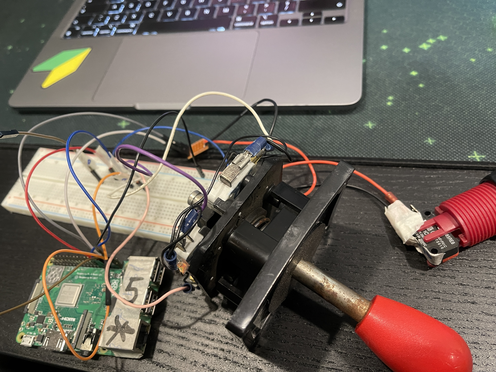

# Lokaverkefni

# Verkefnalýsing
Hugmyndin var að gera eithvað tengd arcade, Ég vilti að gera snake leikinn sem mundi birtast á matrix led skjánum og það mundi lika vera stýrpinni og takkar,það var líka hugmyndin að gera esp32 sem web server til að halda um high score.

# Skýrsla

Fyrsta sem ég gerði var að kynna sér matrix led skjáinn, en komu upp margar villur sem ég gat ekki lagað þannig að ég gafst upp á því og ákvaði að nota fartölvu skjáinn. Ég kynnti sér málið með [Processing](https://processing.org) sem er mjög þæilegur til að nota út að hann er líkur arduino. Ég tengdi við rpi arcade stýr pinna og takkan og fann [snake kóðan](https://github.com/Goel25/SnakeGame) á netinu sem ég notaði til að breyta honum aðeins. svo pælti ég í [MQTT málið](https://www.shiftr.io/try?lang=processing) en náði ég ekki því.

# Kóði

[Kóði](https://github.com/Gabrynio101/Lokaverkefni-/tree/main/SnakeGame1_0)

# Myndir

# Rafrásteikning

# Kerfisskýringarmynd

# Libraries sem ég notaði
> Processing
[Hardware i/o](https://processing.org/reference/libraries/io/index.html)
[Processing MQTT](https://github.com/256dpi/processing-mqtt)
>
